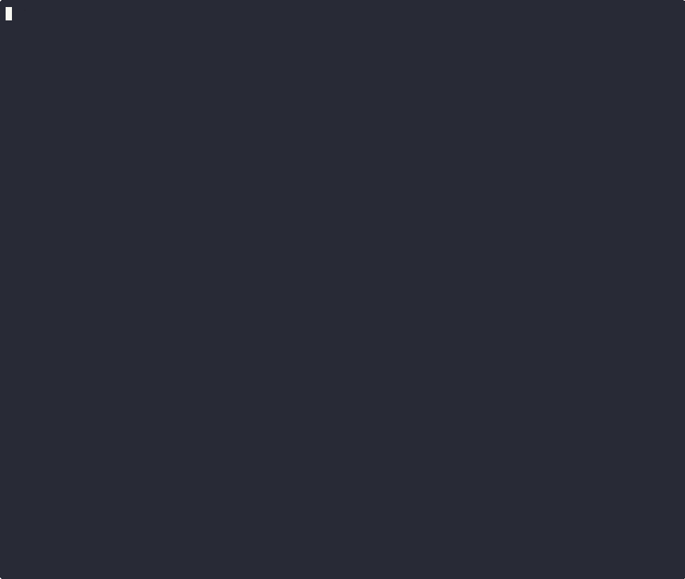

# Motivation

> Prevents unintentional leakage of sensitive fields defined inside `case class`.




Scala's `case class`(es) are an incredibly powerful tool to build complex ADTs; on top of that, they provide out of the
box pretty-print to display their content in different output mediums, such as: console, logs, or even as htt/grpc error
responses (although you shouldn't !).

This makes them really valuable, but also a potential source of sensitive/PII data leakage: suppose your case class
models the Http headers used throughout your apps

```scala
case class HttpHeaders(userID: String, authorization: String, contentType: String, deviceID: String)
```

or a user from DB

```scala
case class User(id: Long, email: String, age: Int, lastLogin: LocalDateTime)
```

you wouldn't want to mistakenly print out to console, log or something else, fields such as the `authorization` token,
an `email`, or the user's `age`.

Wouldn't it be nice if you could just say "when printing out the **whole** case class, don't show the content of
`authorization`?"

Turns out, you can: enter `@redacted` !
